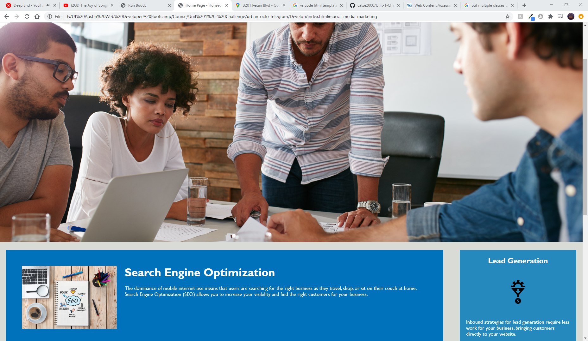

# Code Refactor Starter Code
## Description of Work Completed

### General
1. Updated title to be easier to be more descriptive.
2. Organized CSS styles into groups. Pulled together general/utility styles. 

### Header
1. Edited header to be semantic. 
2. Adjusted CSS to match new element types and names. 
3. Edited links to have nav semantic element type. 
4. Checked links in nav and fixed broken. 
5. Added comments to define sections. 

### Search and Benefit Sections
1. Edited divs to create semantic section and article elements. 
2. Adjusted CSS to match new element types and names. 
3. Reorganized and condensed styling in CSS. 
4. Removed unnecessary classes and cleaned up styling. 
5. Added commentary to define sections. 
6. Added alt to img element to make images accessabile.

### Footer
1. Removed unnecessary class and changed div to footer to be semantic. 
2. Adjusted CSS accordingly. 
3. Added commentary to define sections

### Screenshot of finished website:
#### Screenshot 1

#### Screenshot 2

### Link to repo
[Link to Repo](https://github.com/catse2000/Unit-1-Challenge.git)

[Link to website](https://catse2000.github.io/Unit-1-Challenge/)